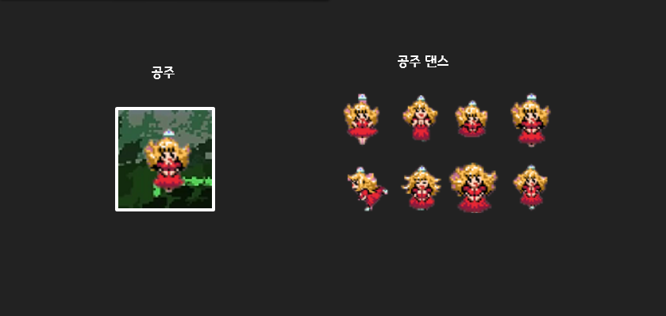

# JumpKing-Game

안녕하세요. 진경빈입니다.
이번에는 2주동안 점프킹을 제작했는데요
어떤 기능들을 구현했는지 알아보도록 하겠습니다
## PPT (그림을 클릭하세요)

## 시연연상 (그림을 클릭하세요)

## 플레이어

### 플레이어의 기능

1. 좌, 우 이동
2. 점프
3. 중력(땅으로 떨어지는 기능)
	이렇게 크게 3가지 입니다
	
####  1. 좌우이동 기능
- 좌, 우 이동 부드럽게
- 좌,우 각각 독립 쓰레드이용
- KeyListener사용
- 벽 인식시  이동불가

###  2. 점프 기능
- 점프후 방향 조작 불가능
  - 좌우 이동 방지
  - 점프 중복 실행 방지
- 기모은 수치만큼 올라가는 기능
  - MAX 100제한 
- 지형지물 충돌 시 반대방향으로 진행
   - 충돌시 방향값 반전
- 지형지물 충돌 시 속도 감소
  - 충돌시 속도 및 점프게이지 감소
- 일정 높이 이상에서 추락시 추락이미지 설정
- 쓰레드 2개로 구성 (상승,하락)
  + 상승 쓰레드 기능
     + 기모으는 쓰레드
     + 상승 쓰레드
  - 하강 쓰레드 기능
    + 하강
 - 포물선 점프
    - 상승, 하강 쓰레드 분기별 속도 차이 존재

### 3. 중력기능
- 중력 발동시 방향 조작 불가능
  - 게임실행시 중력쓰레드 자동실행
 - 일정 높이 이상에서 추락시 추락이미지 적용
 - 점프의 하강쓰레드와 중력쓰레드 동시실행 방지
   - boolean변수를 하나두어서 구별
  

## 지형지물
- 백그라운드 맵
  - BufferedImage의 ImageIo.read로 그림 파일을 읽어오는 방식을 이용
  - Color클래스로 getRGB를 이용해 RGB색상을 읽어옴
  - 검은색 = 땅, 파란색 = 벽, 흰색 = 공중으로 인식

- 스테이지 변환 [위]
  - 특정 Y값보다 높아지면 다음스테이지로 진행
  - 플레이어의 Y값을 땅 아래로 변환
 
 - 스테이지 변환 [아래]
   - 특정 Y값보다 낮아지면 이전 스테이지로 진행
   - 플레이어의 Y값을 맨위로 변환

## 픽셀 체크포인트
- 5가지의 픽셀 판정
	-  머리, 왼쪽, 오른쪽, 땅, 땅 보조 

## 공주
- 공주 gif 효과 주기
  - 3스테이지 전환시 공주 객체생성
  - 생성시 이미지 변환 쓰레드 자동실행

- 공주 트리거 생성
  - 공주와 충돌시 패널 생성
  - 확인 버튼 클릭시 포커스 다시 App에게 전환

## 스테이지 변환
- 플레이어가 특정 Y값 도달시 다음 스테이지 변경
- 각 스페이지마다 스테이지 카운터 적용
- 스테이지 카운터에 알맞은 라벨 출력

## 클레스 다이어그램

블로그 주소 : https://blog.naver.com/skjin20800
