# PooyanGame

## PPT (그림을 클릭하세요)

<a href="./ppt/Pooyan.pptx" download>
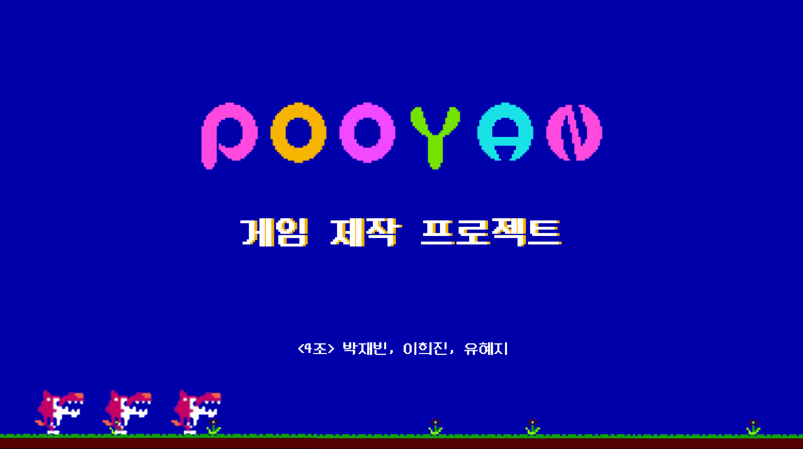
</a>

## 시연영상 (그림을 클릭하세요)

[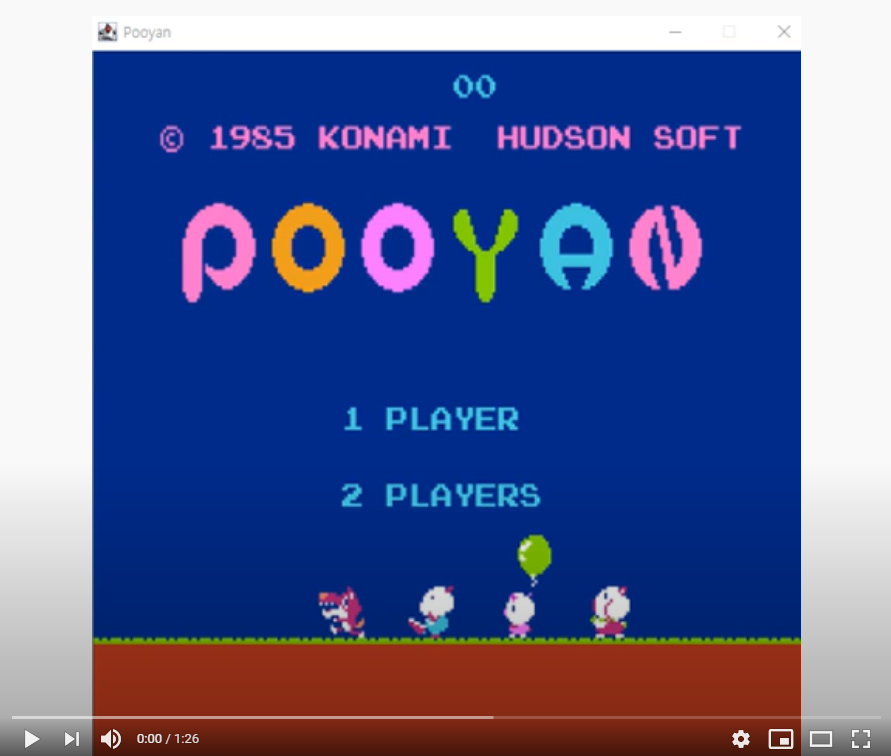](https://www.youtube.com/watch?v=Rada7bVa9Xw&feature=youtu.be)

## 푸얀(플레이어)

### 푸얀의 기능
1. 상하 이동
2. 아이템 획득(고기 폭탄)
3. 공격
4. 죽음

#### 1. 상하 이동
* 키보드 방향키 ↑, ↓
* 독립적인 쓰레드 사용
* 푸얀의 위치에 따라 줄의 길이 변경

``` JAVA
protected void paintComponent(Graphics g) {
	super.paintComponent(g);
	Graphics2D g2 = (Graphics2D) g;
	g2.setColor(new Color(0, 216, 225));
	g2.setStroke(new BasicStroke(3));
	g2.drawLine(jpPlayer.getLocation().x + 35, 100, jpPlayer.getLocation().x + 35, jpPlayer.getLocation().y);
}
```

<p align="center">
  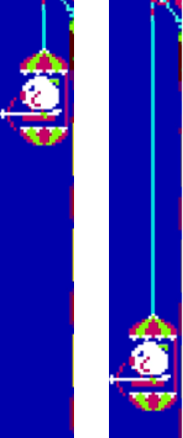
</p>

#### 2. 아이템 획득(고기 폭탄)
* 고기 폭탄 아이템 플레이어 상단에 위치
* 고기 폭탄 획득 시 점수 200점 증가
* 고기 폭탄 획득 시 푸얀 이미지 변경

<p align="center">
  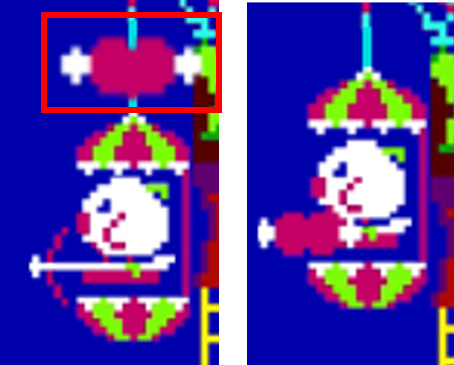
</p>

#### 3. 공격
* 키보드 스페이스 바
* 화살 공격
	- 공격 대기 상태 이미지에서 공격 상태의 이미지로 변경된다.
	- 늑대의 풍선에 화살에 맞으면 점수 200점 증가 후 화살이 사라진다.
	- 늑대의 몸에 화살에 맞으면 화살이 아래로 추락한다.
	

<p align="center">
  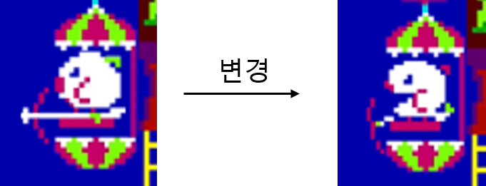
</p>

* 고기폭탄 공격
	- 늑대가 고기폭탄에 맞으면 점수 400점 증가(풍선, 몸 상관없음)
	- 중력이 작용해 포물선을 그리며 아래로 떨어진다.
``` JAVA
meatVy = meatVy + g; // 중력가속도에 의해 meatVy 점점 증가
meatX = meatX + meatVx;
meatY = meatY + meatVy;
```

#### 4. 죽음
* 늑대의 공격에 당했을 때, 땅으로 떨어진다.

<p align="center">
  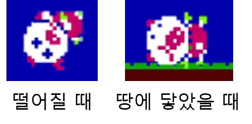
</p>

## 늑대(적)
### 늑대의 기능
1. 자동 생성
2. 자동 이동
3. 공격
4. 죽음

#### 1. 자동 생성
* 약 1초~2초 사이 랜덤한 시간에 자동 생성된다.
``` JAVA
	public void wolfAdd() {
		new Thread(new Runnable() {
			public void run() {
				while (remainWolf > 0 && gameStatus==true) {
					try {
						randWolf = (int) (Math.random() * 3) + 2;
						for (int i = 0; i < randWolf; i++) {
							if(gameStatus==false) {
								reset();
								break;
							}
							wolves.add(new Wolf(pooyanApp, pooyan));
							getContentPane().add(wolves.get(count));
							count = wolves.size();
							System.out.println(TAG + " 늑대 " + count);
							Thread.sleep(1000);
						}
						randTime = (int) (Math.random() * (3000 - 1000 + 1)) + 1000;
						Thread.sleep(randTime);
					} catch (Exception e1) {
						e1.printStackTrace();
					}
				}
			}
		}).start();
	}
```

#### 2. 자동 이동
* 생성된 늑대가 자동으로 이동한다.
	- 나무 위에서 오른쪽으로 이동한다.
	- 풍선을 타고 아래로 떨어진다.
	- 땅에서 오른쪽으로 이동한다.
	- 사다리를 타고 올라간다.
* 방향에 따라 독립적인 쓰레드를 사용한다.(나무 위에서 오른쪽 이동, 땅에서 오른쪽 이동은 같은 쓰레드 사용)

<p align="center">
  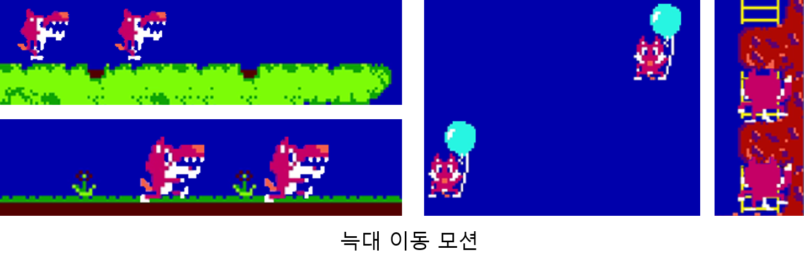
</p>

#### 3. 공격
* 원거리 공격 : 늑대가 폭탄을 푸얀쪽으로 던진다.
* 근거리 공격 : 늑대가 사다리에서 공격한다.

<p align="center">
  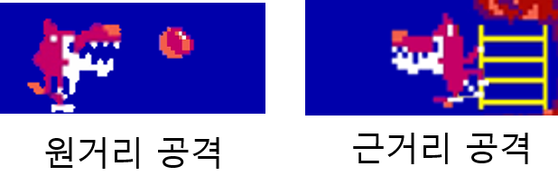
</p>

#### 4. 죽음
* 푸얀이 쏜 화살이나 고기 폭탄을 맞을 시 땅에 떨어진다.
* 남은 늑대의 수가 줄어든다.
떨어지는 이미지, 땅에 닿았을 때 이미지 삽입

## 화면 전환
1. 시작 화면
2. 게임 화면
3. 점수 확인 화면

### 1. 시작 화면(TitleFrame)
* 프로그램 시작 초기 화면
* 키보드의 엔터 키로 다음 프레임 실행 -> 본 프레임 종료

<p align="center">
  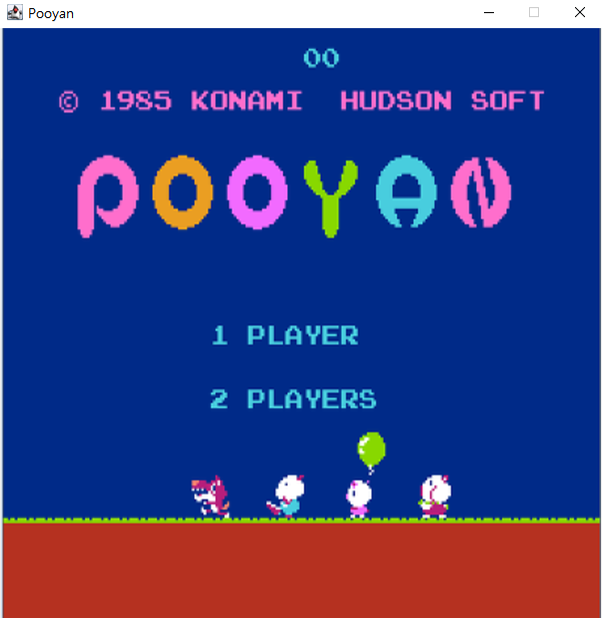
</p>

### 2. 게임 화면(PooyanApp)
* 게임이 진행되는 화면
* 플레이어의 생명이 전부 소진되거나 남은 늑대 수가 없으면(게임오버) 다음 프레임 실행 -> 본 프레임 종료X

<p align="center">
  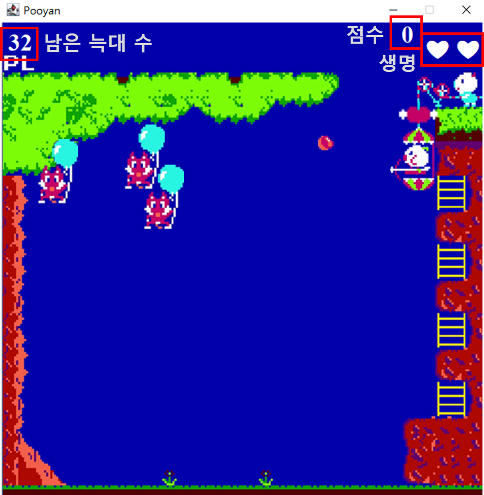
</p>

### 3. 점수 확인 화면(ScoreFrame)
* 게임오버 시 게임 화면 위에 점수 확인할 수 있는 프레임을 띄운다.

<p align="center">
  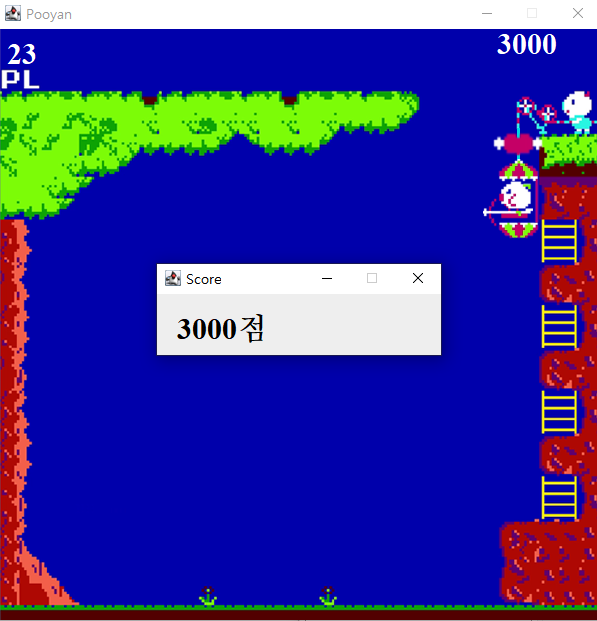
</p>

## 클래스 다이어그램

<p align="center">
  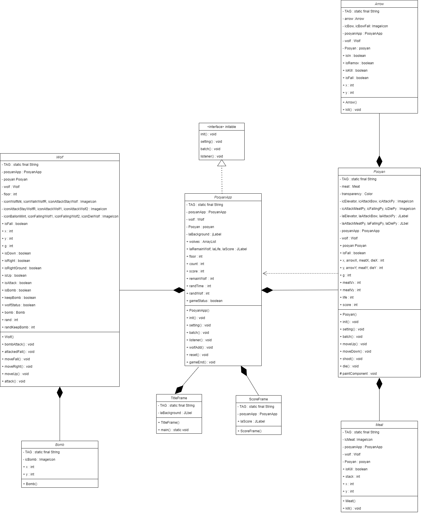
</p>
